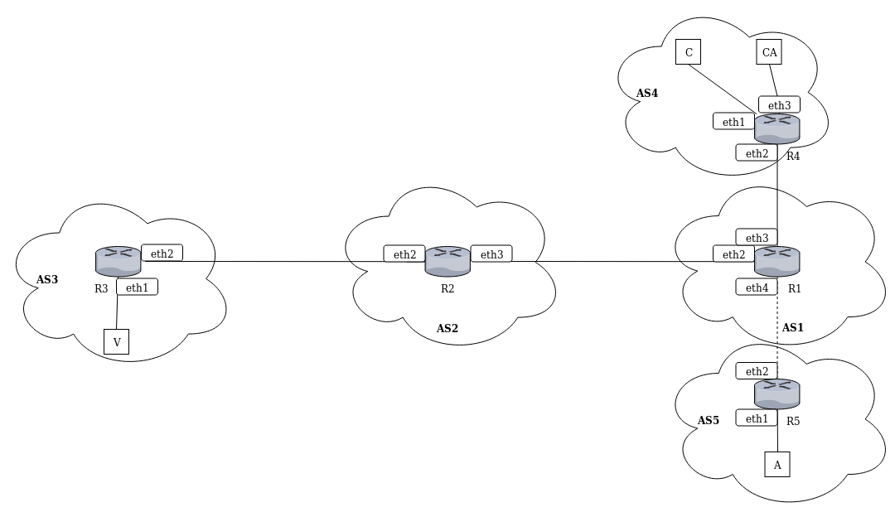
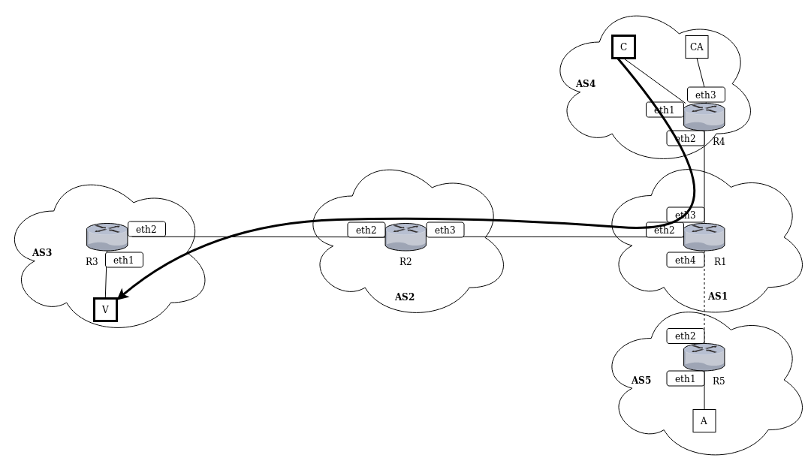
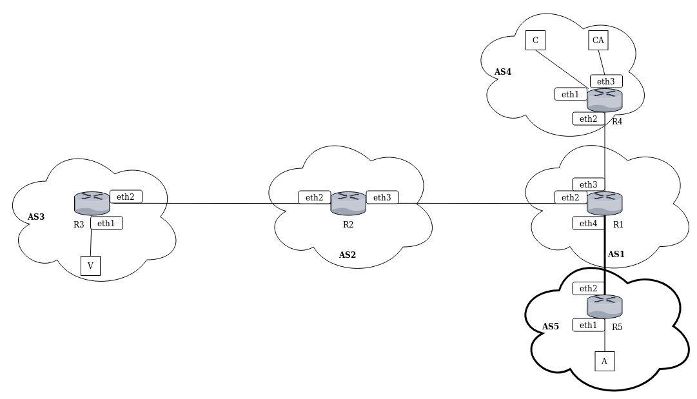
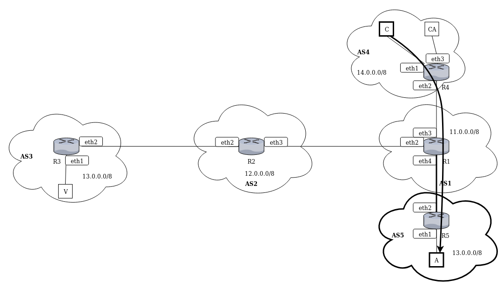

# bgp-breaking-https-with-bgp-hijacking

Descrizione dell'attacco disponibile qui: https://www.blackhat.com/docs/us-15/materials/us-15-Gavrichenkov-Breaking-HTTPS-With-BGP-Hijacking.pdf

---

## Preparazione Mininet

- `git clone https://github.com/mininet/mininet`

- `cd mininet`

- `git checkout 2.3.0d4`

- `util/install.sh -a`

- `mn --test pingall`

- `mn --version`

## Preparazione Quagga

- esegui il download quagga-1.2.4 da [qui](http://download.savannah.gnu.org/releases/quagga/) nella tua `$HOME` ed estrai il file compresso

- `cd ~/quagga-1.2.4`

- `chown mininet:mininet /var/run/quagga`

- modifica il file `configure`, aggiungendo `${quagga_statedir_prefix}/var/run/quagga` prima di tutte le opzioni nel loop `for` per `QUAGGA_STATE_DIR`

- `./configure --enable-user=mininet --enable-group=mininet`

- `make`

---

## Descrizione dell'attacco

\# TODO

## Esecuzione dell'attacco

**installa openssl**

`apt install openssl`

**pulisci la $HOME da .rnd**

`rm ~/.rnd`

**crea una CA** in `./CA`

> https://workaround.org/certificate-authority/

in `./CA` lanciare

`/usr/lib/ssl/misc/CA.pl -newca`

	PEM pass phrase: password

	Country Name (2 letter code) [AU]:IT  
	State or Province Name (full name) [Some-State]:Lazio   
	Locality Name (eg, city) []:Roma  
	Organization Name (eg, company) [Internet Widgits Pty Ltd]:RootCA  
	Organizational Unit Name (eg, section) []:IT  
	Common Name (e.g. server FQDN or YOUR name) []:rootca.it  
	Email Address []:admin@rootca.it

	A challenge password []:password  
	An optional company name []:RootCA  
	Enter pass phrase for ./demoCA/private/cakey.pem: password

`./CA/demoCA/cacert.pem` certificato pubblico della CA

**crea la richiesta del server alla CA** in `./server`

`/usr/lib/ssl/misc/CA.pl -newreq`

	PEM pass phrase: server

	Country Name (2 letter code) [AU]:IT  
	State or Province Name (full name) [Some-State]:Lazio  
	Locality Name (eg, city) []:Roma  
	Organization Name (eg, company) [Internet Widgits Pty Ltd]:MainServer  
	Organizational Unit Name (eg, section) []:IT  
	Common Name (e.g. server FQDN or YOUR name) []:13.0.1.1  
	Email Address []:admin@mainserver.it

	A challenge password []:server  
	An optional company name []:MainServer

`./server/newkey.pem` chiave privata  
`./server/newreq.pem` richiesta

**firma la richiesta e crea il certificato per il server**

copia `./server/newreq.pem` in `./CA`

in `./CA` firma la richiesta

`/usr/lib/ssl/misc/CA.pl -sign`

Enter pass phrase for ./demoCA/private/cakey.pem:password  
Sign the certificate? [y/n]:y  
1 out of 1 certificate requests certified, commit? [y/n]y

copia il certificato `./CA/newcert.pem` in `./server`

**prepara il certificato per server**

> https://stackoverflow.com/a/20908026

in `./server`

`openssl rsa -in newkey.pem -out newkey_unencrypted.pem`

**accedi al server verificando il certificato**

`./client-curls-server-https.sh`

**crea la richiesta del malicious-server alla CA** in `./malicious-server`

`/usr/lib/ssl/misc/CA.pl -newreq`

	Enter PEM pass phrase:malicious

	Country Name (2 letter code) [AU]:IT  
	State or Province Name (full name) [Some-State]:Lazio  
	Locality Name (eg, city) []:Roma  
	Organization Name (eg, company) [Internet Widgits Pty Ltd]:MainServer  
	Organizational Unit Name (eg, section) []:IT  
	Common Name (e.g. server FQDN or YOUR name) []:13.0.1.1  
	Email Address []:admin@13.0.1.1  

	A challenge password []:malicious  
	An optional company name []:MainServer

**lancia l'hijacking**

`./start-malicious-AS.sh`

**avvia il malicious-server**

`./start-malicious-server.sh`

**verifica che la CA raggiunga il malicious-server**

`./CA-curls-server.sh`

**firma la richiesta e crea il certificato per il malicious-server**

copia `./malicious-server/newreq.pem` in `./CA`

in `./CA/demoCA/index.txt.attr` imposta il flag `unique_subject` a `no`

NB. di default la CA non può firmare un secondo certificato con lo stesso Common Name di un certificato già firmato  
il flag modificato rimuove questo vincolo

in `./CA` firma la richiesta

`/usr/lib/ssl/misc/CA.pl -sign`

copia il certificato `./CA/newcert.pem` in `./malicious-server`

**prepara il certificato per malicious-server**

in `./malicious-server`

`openssl rsa -in newkey.pem -out newkey_unencrypted.pem`

**avvia il malicious-server col certificato ottenuto**

`./start-malicious-server-https.sh`

**accedi al malicious-server verificando il certificato**

controlla l'output di `./client-curls-server-https.sh`

**ferma la simulazione**

`mininet> exit`
